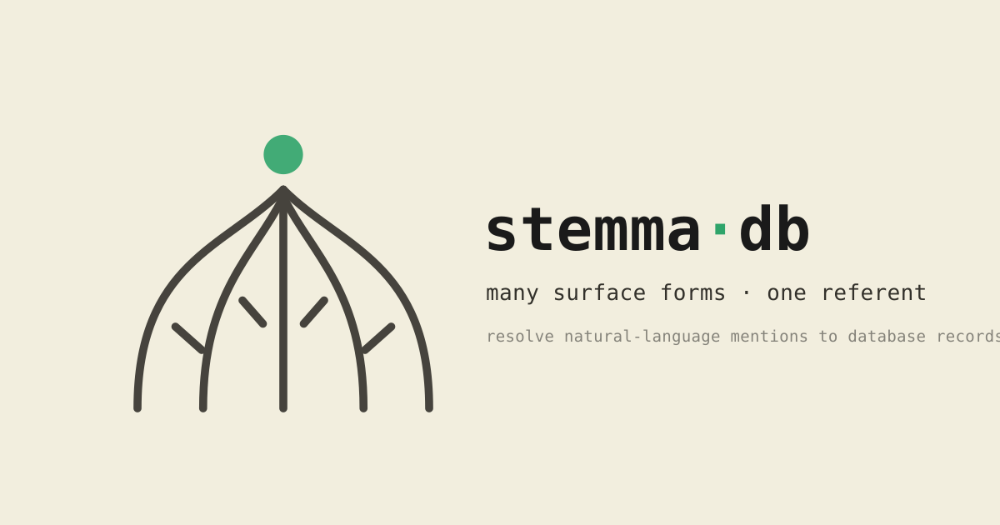

<p>
  <picture>
    <source media="(prefers-color-scheme: dark)" srcset="assets/brand/banner-dark.svg">
    
  </picture>
</p>

<sub>witness branches fanning from one stem, converging on the lost archetype —
the accent dot is the referent. <a href="docs/brand.md">brand</a></sub>

# stemma

Ground natural-language queries in concrete database records, then compile
them into safe, parameterized, read-only SQLite queries.

A query names things obliquely — by nickname, by abbreviation, by description, by
association. *the Q3 numbers for the Seattle office*, *what did Chen's team ship*,
*the crown's holdings*. Each of those mentions has to be pinned to an actual row
before the query can run. stemma first does that pinning: it spans mentions,
links them to candidate records, and returns an evidence-rich trace. The
semantic parser builds directly from that trace after ambiguity is resolved.

## Name

In textual criticism a *stemma codicum* is the tree of surviving manuscript
witnesses, each one a corrupt and divergent copy, reconstructed to show how they
all descend from a single lost archetype. The philologist's job is to work
backward from the variants to the thing they are all versions of.

Same job here. Many surface forms, one referent.

## Status

Early. Nothing to install yet.

## Documentation

- [docs/](docs/README.md) — user guide (setup, concepts, server, corpora),
  a verified [walkthrough](docs/walkthrough.md), and the
  [architecture](docs/architecture.md) with the literature review behind it
- [crates/stemmadb/README.md](crates/stemmadb/README.md) — the storage layer
- [skills/](skills/) — task recipes for LLM agents: set up stemmadb, build
  corpora, run evals, contribute code

## Layout

The design and the literature behind it are in
[docs/architecture.md](docs/architecture.md). In short: a grounding-first Rust
semantic parser beside a stock SQLite database. The storage layer is **stemmadb**
(`crates/stemmadb`): the user's database is attached read-only, and every
derived artifact — lexical and vector indexes, the knowledge store, the embed
queue, the model registry — lives in a sidecar `.stemmadb` file. Retrieval is
hybrid (FTS5 BM25 + trigram + sqlite-vec) fused in SQL; embedders and LMs are
pluggable backends behind traits, reached over gRPC and the OpenAI-compatible
protocol respectively.

- `proto/` — the gRPC Resolve and Embedder APIs (source of truth; generated
  code is checked into `crates/stemma-proto/src/gen`, refreshed by
  `tools/regen_protos.sh`)
- `crates/` — `stemmadb` (storage), `stemma-resolve` (pipeline), `stemma-kg`
  (knowledge store), `stemma-embed` / `stemma-lm` (model backends),
  `stemma-parse` (grounded query validation), `stemma-server` (gRPC front
  door), `stemma-eval` (BIRD harness)
- `eval/bird/` — BIRD no-evidence evaluation: `fetch_bird.sh`, then
  `stemma-eval derive` to extract resolution targets from gold SQL
- `third_party/` — vendored SQLite headers and sqlite-vec, statically linked

## Build

Bazel is the build system; the Cargo workspace doubles as the dependency
manifest and keeps `cargo test` usable for fast iteration.

```sh
bazel test //...        # or: cargo test
bazel run //crates/stemma-server -- --db mydb=path/to/user.db
```
