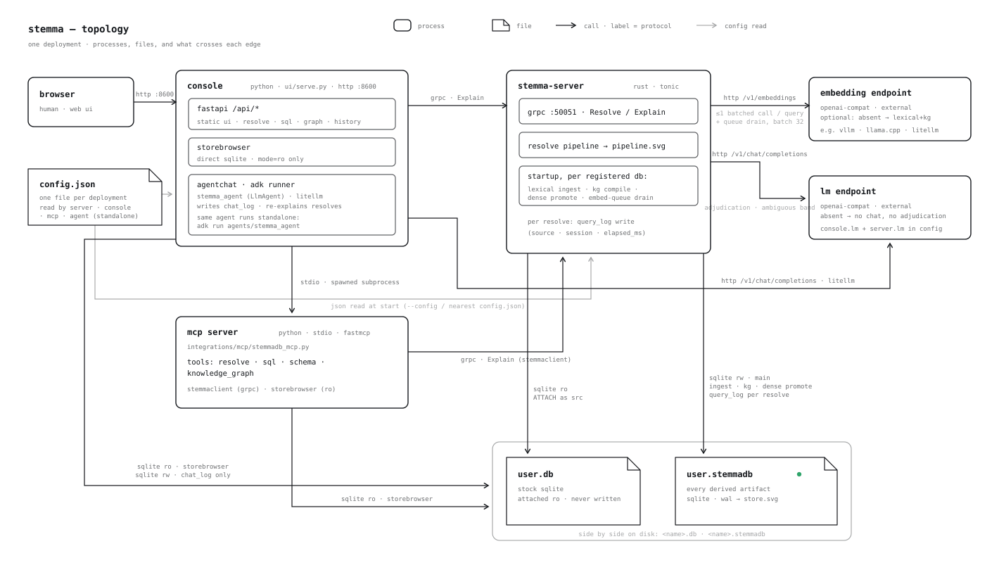
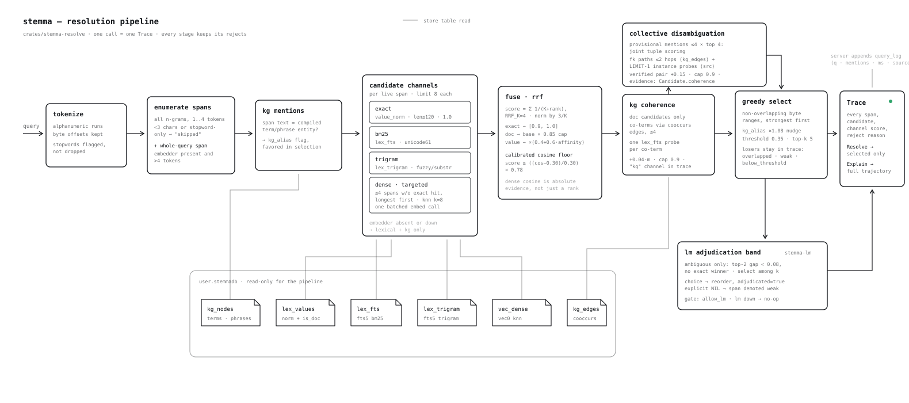
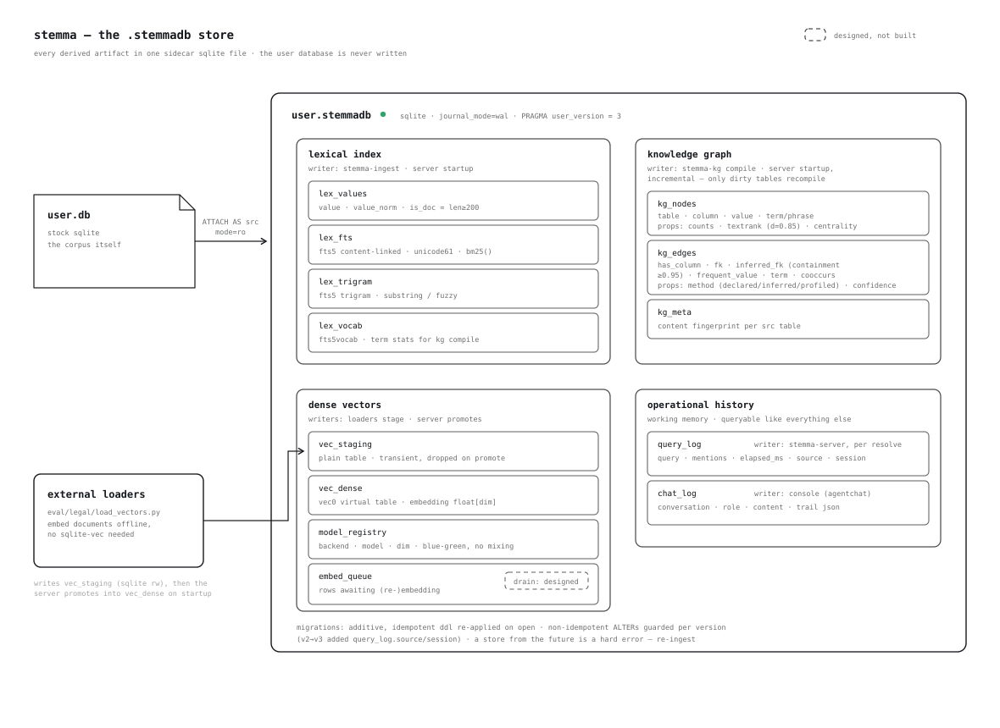
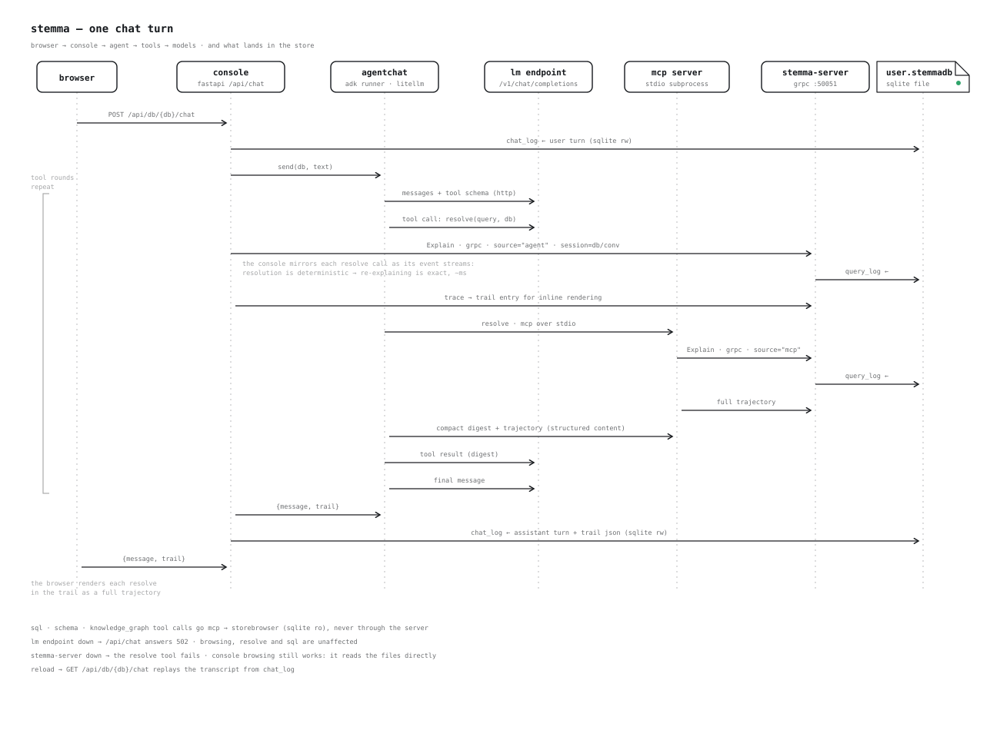

# stemma — architecture, visually

Four hand-drawn diagrams and the walk through them. Every box and arrow here
is checked against the code as it stands.
The prose companion is [architecture.md](architecture.md) and the deep
reference is [docs/design/](design/README.md); every constant drawn in a
diagram (RRF_K, thresholds, caps, margins) is specified — with its
justification and citations — in the design doc for its stage, and the
research claims behind the architecture are cited in the
[shared bibliography](design/00-bibliography.md).

Each diagram is a single SVG in [`assets/diagrams/`](../assets/diagrams):
strokes and text follow `currentColor` with a light/dark media-query
fallback, so the same file reads on white and on dark paper. Pre-rendered
PNGs (2x, both grounds) live in
[`assets/diagrams/png/`](../assets/diagrams/png).

---

## topology — who runs, what sits on disk, what crosses each edge

Rounded boxes are processes; folded-corner boxes are files. Every edge is
labeled with its protocol and direction.

**stemma-server** (`crates/stemma-server`, Rust) is the gRPC front door on
`127.0.0.1:50051`, serving two RPCs: `Resolve` (selected mentions with
evidence) and `Explain` (the full trajectory, near-misses included). At
startup it registers each configured database: it opens the `.stemmadb`
sidecar as the connection's `main` schema, attaches the user database
read-only as `src`, builds the lexical index (`stemma-ingest`), compiles the
knowledge graph (`stemma-kg`), and promotes any staged vectors into the
dense index. After every non-empty resolve it appends one `query_log` row —
a failed history write never fails the resolution.

**console** (`ui/serve.py`, FastAPI on `:8600`) is the optional web UI, and
nothing in the core depends on it. It is three things in one process: the
`/api/*` layer plus static UI; a `StoreBrowser` that reads the two SQLite
files directly (`mode=ro` on every connection — schema, rows, knowledge
graph, query history, SQL scratchpad); and `AgentChat`, an in-process ADK
runner wrapped around the reference agent. Resolution never happens locally:
`/api/db/{name}/resolve` forwards to the server over gRPC. The console's one
sanctioned store write is `chat_log`.

**mcp server** (`integrations/mcp/stemmadb_mcp.py`, stdio) exposes stemma as
tools for any MCP client: `resolve` (gRPC `Explain` via `StemmaClient`,
returning a compact digest plus the full trajectory as structured content),
`sql` (read-only SELECT over `src` + store), `schema`, and
`knowledge_graph`. Browsing tools use `StoreBrowser` and never touch the
server; only `resolve` does.

**reference agent** (`agents/stemma_agent`) is a plain ADK `LlmAgent` whose
toolset is the MCP server spawned as a stdio subprocess. It runs in two
places with the same code: inside the console (as `AgentChat`'s agent) and
standalone via `adk run agents/stemma_agent`. The model is anything
OpenAI-compatible, reached through LiteLLM.

**model endpoints** are external and both optional. The embedding endpoint
speaks `/v1/embeddings` and enables the dense channel — the server uses it
both per query (≤1 batched call) and for the startup queue drain; absent or
down, resolution degrades to lexical + kg and keeps answering. The LM
endpoint speaks `/v1/chat/completions` and serves two callers: the console's
chat view (via LiteLLM) and the server's adjudication band — without it the
console answers 503 on `/api/db/{name}/chat` and resolution simply ships
unadjudicated traces.

**files.** `user.db` is the user's stock SQLite database; every process that
opens it does so read-only, and stemma never writes it. `user.stemmadb` is
the sidecar holding every derived artifact (next diagram). `config.json` is
the one deployment file: the server reads `databases` + `server.*`, the
console and MCP server read their own sections of the same file, flags
override, and configuration never comes from environment variables.

**degradation summary:** embedder down → lexical+kg resolution, queue items
stay pending; LM down → no chat and unadjudicated traces, everything else
intact; stemma-server down → the console
still browses, runs SQL and shows history (direct file reads) but
`/api/db/{name}/resolve` answers 502.

---

## pipeline — from query to Trace

The whole pipeline is one function, `stemma_resolve::resolve`, and it is
read-only against the store. Left to right:

**tokenize** splits the query into alphanumeric runs, keeping byte offsets.
Stopwords are flagged, not dropped — a stopword can still sit inside a
longer span.

**enumerate spans** produces every n-gram up to 4 tokens. Spans under 3
characters or made only of stopwords are kept in the trace as `skipped` so
the UI can grey them rather than lose them. When an embedder is configured
and the query is longer than 4 tokens, the whole query becomes one more
span: anchor-free semantic mentions ("getting fired from a state job") have
no lexical n-gram, but the full phrase lands near the right documents in
vector space, and greedy selection arbitrates between it and any strong
lexical anchors.

**kg mention detection** marks spans whose text equals a compiled term or
phrase entity (`kg_nodes`, kind `term`). The flag (`kg_alias`) earns a
×1.08 nudge at selection time — a compiled multi-word phrase like "coastal
development permit" is better evidence of mention-hood than raw match
strength, so it beats its own fragments.

**candidate channels**, at most 8 hits each per span. Three always run:
`exact` (normalized equality against `lex_values.value_norm`, values ≤120
chars, raw score 1.0), `bm25` (`lex_fts`, FTS5/unicode61), and `trigram`
(`lex_trigram`, fuzzy/substring). The `dense` channel is targeted, not
blanket: KNN over `vec0` is a full scan per probe, so it is spent only on
spans with no exact hit, longest first, at most 4 per query, embedded in one
batched call. An embedding failure logs a warning and degrades — it never
aborts the resolution.

**fusion** is reciprocal-rank fusion with `RRF_K = 4`, normalized so three
rank-0 channels reach 1.0, then shaped by what the candidate is: exact
matches land in [0.9, 1.0] (definitionally right about the value), documents
cap at 0.85 (a mention resolves *into* a document; punishing length would
break retrieval), and short values scale by a length-affinity factor. The
dense cosine then acts as a calibrated floor —
`score ≥ ((cos − 0.30)/0.30) · 0.78` — because a 0.6-cosine match must
survive having no lexical company.

**kg coherence** runs when document candidates are present and a compiled
graph exists: up to 4 terms that co-occur with the span's tokens are looked
up in `kg_edges`, each is probed against the candidate's `lex_fts` row, and
matches add +0.04 each, capped at 0.9 — a tiebreaker that appears in the
trace as the `kg` channel, never a retrieval signal.

**collective disambiguation** runs before selection: the provisional
mention set (strongest 4, top 4 candidates each) is scored jointly. A pair
of candidates whose tables connect through fk/inferred-fk edges (≤2 hops,
via `stemma_kg::table_paths`) is verified with a `LIMIT 1` probe against
the read-only source database; the winning tuple's verified candidates get
+0.15 (capped at 0.9) and carry the path as `Candidate.coherence` — how
"Chen" becomes *the* Chen who leads the team you also mentioned.

**greedy selection** lets the strongest spans claim non-overlapping byte
ranges; within a winning span the top 5 candidates at or above 0.35 are
selected. Everything that lost stays in the trace with its reason:
`overlapped`, `weak`, `below_threshold`, `outranked`, `span_not_selected`.

**the LM adjudication band** (`crates/stemma-lm`) runs after selection, on
the ambiguous band only: top-two gap under `ADJUDICATION_MARGIN = 0.08` and
no exact winner. The LM selects among the presented candidates or answers
an explicit NIL — a choice reorders (marked `adjudicated`), a NIL demotes
the span to `weak`. It is gated per request by `ResolveOptions.allow_lm`,
and an absent or failing LM is a no-op: the trace is exactly what fusion
produced.

**out** comes a `Trace`: `Resolve` serializes only the selected mentions,
`Explain` the entire trajectory. The server then appends `query_log`
(query · mentions · elapsed_ms · source · session).

---

## store — anatomy of the `.stemmadb` sidecar

One SQLite file (WAL mode, `PRAGMA user_version = 5`) holds everything
stemma derives; the user database is attached read-only as `src` and is
never written. Groups, with their writers:

**lexical index** — written by `stemma-ingest` at server startup and on
refresh (receipt-driven: only tables whose content fingerprint moved
re-ingest; `force` re-ingests everything). `lex_values`
carries every text value of every user table with its normalized form and an
`is_doc` flag (derived per column from the corpus's length distribution: a
document a mention resolves *into*, not a
value it equals; values over 120 chars are excluded from the exact channel).
`lex_fts` and `lex_trigram` are content-linked FTS5 indexes over the same
rows; `lex_vocab` is an fts5vocab table the knowledge compiler uses for term
statistics.

**knowledge graph** — written by `stemma-kg::compile` at startup,
incrementally: each table's content fingerprint lands in `kg_meta`, and only
tables whose fingerprint changed are recompiled. `kg_nodes` holds the schema
layer (tables, columns), profiled frequent values, and characteristic
terms/phrases of document corpora, ranked by TextRank (damping d=0.85) with
a graph-wide PageRank stored as `centrality` on every node. `kg_edges` holds
`has_column`, declared `fk`, `inferred_fk` from inclusion-dependency mining
(proposed at containment ≥0.95), `frequent_value`, `term`, and `cooccurs`
edges — every edge carries provenance (`method`: declared / inferred /
profiled) and a confidence in its props.

**dense vectors** — two writers, deliberately split. External loaders (e.g.
`eval/legal/load_vectors.py`) embed documents offline and write plain rows
into `vec_staging`, which needs no sqlite-vec extension. At startup the
server — the extension-bearing process — creates the `vec0` table
`vec_dense`, moves the vectors in, records the model identity in
`model_registry` (one model per vector table; a model change is a blue-green
swap, never a silent mix of vector spaces), and drops the staging table.
Mixed model identities in staging are a hard error. `embed_queue` holds
documents awaiting embedding (status, attempts ≤3, error note): at startup
the server enqueues every document lacking a vector and a background task
per database drains the queue through the embedder in batches of 32 —
serving is never blocked, and resolution gets denser as the drain runs. A
registry row bound to a different model refuses the whole batch rather
than mixing vector spaces.

**operational history** — the store is also working memory. `query_log` is
written by the resolution server after every resolve, tagged with `source`
("console", "agent", "mcp") and `session`; `chat_log` is written by the
console's `AgentChat` — conversation, role, content, and the tool trail as
JSON. Both are ordinary tables, queryable through the console's SQL view or
the MCP `sql` tool like everything else.

**migrations** are additive: the full DDL is idempotent and re-applied on
open, non-idempotent `ALTER`s are guarded per version (v2→v3 added
`query_log.source/session`), and a store from the future is a hard error
with one remedy — re-ingest. The index tables are derived state, so shape
changes there are handled by dropping and rebuilding rather than migrating.

---

## conversation — one chat turn, end to end

The browser POSTs `/api/db/{db}/chat`. The console logs the user turn to
`chat_log`, then hands the text to `AgentChat`, which drives the ADK runner:
LiteLLM sends the transcript and tool schema to the configured
OpenAI-compatible LM endpoint.

When the LM answers with a `resolve(query, database)` tool call, two things
happen. First, the console sees the function-call event in the runner's
stream and mirrors it: it calls `Explain` itself (source `"agent"`, session
`"{db}/{conversation}"`). Resolution is deterministic, so this re-explain is
exact and costs about a millisecond — it exists to rebuild the full
trajectory for the console's inline rendering, because the digest the model
gets back is deliberately compact. Then the tool executes: the ADK toolset
forwards the call over stdio to the MCP server, whose `StemmaClient` calls
`Explain` on stemma-server (source `"mcp"`). Each `Explain` also appends a
`query_log` row, which is why one chat resolve shows up twice in history,
once per source tag.

The MCP server returns the compact digest (selected candidates, truncated
values, near-miss span texts) with the full trajectory attached as
structured content; the digest goes back to the LM as the tool result. The
`sql`, `schema` and `knowledge_graph` tools take the short path — MCP →
`StoreBrowser`, read-only SQLite, no server involved. Tool rounds repeat
until the LM produces a final message.

The console then logs the assistant turn plus the tool trail (JSON) to
`chat_log` and answers the browser with `{message, trail}` — each resolve in
the trail carrying its trace, which the UI renders as the same trajectory
view the resolve tab uses. A page reload replays the whole transcript from
`chat_log`.

**failure behavior** is layered like the topology: LM endpoint down →
`/api/chat` answers 502 and everything else keeps working; stemma-server
down → the resolve tool and the re-explain fail while browsing and SQL
continue from the files; embedder down → chat still works, resolves are
lexical + kg only.
